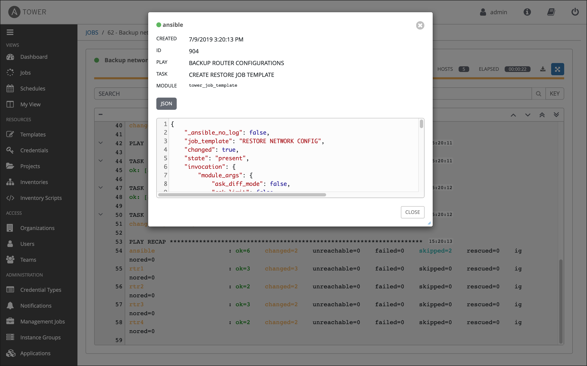

M# Exercise 6: Creating a Tower Job Template

## Table of Contents

- [Objective](#objective)
- [Guide](#guide)
   - [Step 1: Create a Job Template](#step-1-create-a-job-template)
   - [Step 2: Launch the Job Template](#step-2-launch-the-job-template)
   - [Step 3: Examine the Job Details View](#step-3-examine-the-job-details-view)
   - [Step 4: Examine the Jobs window](#step-4-examine-the-jobs-window)
   - [Step 5: Verify the export policies were created](#step-5-verify-the-backups-were-created)
- [Takeaways](#takeaways)

# Objective

Demonstrate applying an export policy job template for Red Hat Ansible Tower.  This job template will create an export policy on your Ontap device so that the volumes that you previously created can be shared.

To run an Ansible Playbook in Ansible Tower we need to create a **Job Template**.  A **Job Template** requires:
 - An **Inventory** to run the job against
 - A **Credential** to login to devices.
 - A **Project** which contains Ansible Playbooks

# Guide

## Step 1: Create a Job Template

1.  Open the web UI and click on the `Templates` link on the left menu.

     button to create a new job template

    >Make sure to select `Job Template` and not `Workflow Template`)

3. Fill out the job template parameters as follows:

    | Parameter | Value |
    |---|---|
    | Name  | Create Export Policy  |
    |  Job Type |  Run |
    |  Inventory |  Workshop Inventory |
    |  Project |  Workshop Project |
    |  Playbook |  create-policy.yml |
    |  Credential |  Workshop Credential |


4. Scroll down and click the green `save` button.

Here is a walkthrough:


Prefer Youtube?  [Click Here](https://youtu.be/EQVkFaQYRiE)


## Step 2: Launch the Job Template

1. Navigate back to the `Templates` window, where all Job Templates are listed.

2. Launch the `Create Export Policy` Job Template by clicking the Rocket button.

    

    When the rocket button is clicked this will launch the job.  The job will open in a new window called the **Job Details View**.  More info about [Tower Jobs](https://docs.ansible.com/ansible-tower/latest/html/userguide/jobs.html) can be found in the documentation.

## Step 3: Examine the Job Details View

On the left side there is a **Details pane** on the right side there is the **Standard Out pane**.


1.  Examine the **Details pane**    

    The **Details pane** will information such as the timestamp for when the job started and finished, the job type (Check or Run), the user that launched the job, which Project and Ansible Playbook were used and more.

    If the Job has not finished yet, the **Details Pane** will have a cancel button  that can be used to stop the Job.

2.  Examine the **Standard Out pane**

    The **Standard Out pane** will display the output from the Ansible Playbook.  Every task output will match exactly what would be seen on the command line.

3.  Click on the **Expand Output** button 

    This will expand the **Standard Out pane** to take the entirety of the window.

4.  Click on a task in the **Standard Out pane** to open up structured output from that particular task.

    > Click on any line where there is a **changed** or **ok**

    

## Step 4: Examine the Jobs window

Any **Job Template** that has been run or is currently running will show up under the **Jobs** window.

1. Click the Jobs button the left menu.

    

    The Jobs link displays a list of jobs and their status–shown as completed successfully or failed, or as an active (running) job. Actions you can take from this screen include viewing the details and standard output of a particular job, relaunch jobs, or remove jobs.

2. Click on the **Create Export Policy** Job

    

    The **Create Export Policy** job was the most recent (unless you have been launching more jobs).  Click on this job to return to the **Job Details View**.  Ansible Tower will save the history of every job launched.

## Step 5: Verify the export policy was created

1. Login to ontap cluster manager and check that the volumes were created using the `vserver export-policy rule show` command:

```
citi_student1::> vserver export-policy rule show
             Policy          Rule    Access   Client                RO
Vserver      Name            Index   Protocol Match                 Rule
------------ --------------- ------  -------- --------------------- ---------
svm_citi_student1
             export-svm_citi_student1
                             1       any      172.48.0.0/20         any
svm_citi_student1
             export-svm_citi_student1
                             2       any      172.48.0.0/16         any
svm_citi_student1
             export-svm_citi_student1-ansibleVol1
                             1       any      172.48.0.0/16         any
svm_citi_student1
             export-svm_citi_student1-ansibleVol2
                             1       any      172.48.0.0/16         any
4 entries were displayed.
```


# Takeaways

You have successfully demonstrated
 - Creating a Job Template for creating export policies
 - Launching a Job Template from the Ansible Tower UI
 - Verifying the policies were correctly created

---

# Complete

You have completed lab exercise 6

[Click here to return to the Ansible Network Automation Workshop](../README.md)
