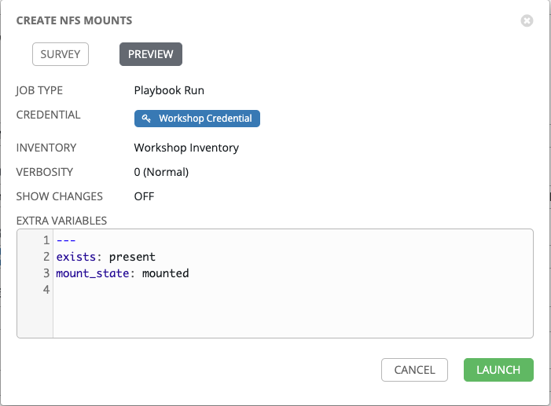

# Exercise 7: Creating a Survey

## Table of Contents

- [Objective](#objective)
- [Guide](#guide)
   - [Step 1: Create a Job Template](#step-1-create-a-job-template)
   - [Step 2: Examine the playbook](#step-2-examine-the-playbook)
   - [Step 3: Create a survey](#step-3-create-a-survey)
   - [Step 4: Launch the Job Template](#step-4-launch-the-job-template)
   - [Step 5: Verify changes on device](#step-5-verify-the-banner)
- [Takeaways](#takeaways)

# Objective

Demonstrate the use of Ansible Tower [survey feature](https://docs.ansible.com/ansible-tower/latest/html/userguide/job_templates.html#surveys). Surveys set extra variables for the playbook similar to ‘Prompt for Extra Variables’ does, but in a user-friendly question and answer way. Surveys also allow for validation of user input.

# Guide

## Step 1: Create a Job Template

1. Open the web UI and click on the `Templates` link on the left menu.

   

2. Click on the green `+` button to create a new job template (make sure to select `Job Template` and not `Workflow Template`)

   | Parameter | Value |
   |---|---|
   | Name  | Mount NFS Shares |
   |  Job Type |  Run |
   |  Inventory |  Workshop Inventory |
   |  Project |  Workshop Project |
   |  Playbook |  `nfs-mount.yml` |
   |  Credential |  Workshop Credential |

3. Scroll down and click the green `SAVE` button.  


## Step 2: Examine the playbook

Here is what the  `nfs-mount.yml` Ansible Playbook looks like:

<!--  -->
```yml
---
- hosts: web
  gather_facts: no
  vars:
    volname:
      - "ansibleVol1"
      - "ansibleVol2"
  #Variables to passed in:
    #state:
    #mount_state:
  tasks:
  - name: Update fstab file
    lineinfile:
      state: "{{ exists }}"
      path: /etc/fstab
      line: "{{data_ips}}:/{{ item }} /mnt/{{ item }} nfs defaults 0 0"
    with_items: "{{ volname }}"

  - name: Verify mount directory exists
    file:
      state: "{{ exists }}"
      path: "/mnt/{{ item }}"
      state: directory
    with_items: "{{ volname }}"

  - name: Mount nfs export
    mount:
      state: "{{ mount_state }}"
      path: "/mnt/{{ item }}"
      src: "{{data_ips}}:/{{ item }}"
      fstype: nfs
    with_items: "{{ volname }}"

  - name: Show volume is mounted
    shell: "df -h"
    register: output

  - debug:
      msg: "{{ output.stdout.split('\n') }}"
```
<!--  -->


> Note: You can also view the Ansible Playbook here: [https://github.com/leerich/ansible-storage](https://github.com/leerich/ansible-storage)

The first task is editing the `/etc/fstab` file and adding mount points.  This task is using the `lineinfile` module.

- The `lineinfile` module ensures a particular line is in a file, or replace an existing line using a back-referenced regular expression.
- This is primarily useful when you want to change a single line in a file only.
- See the replace module if you want to change multiple, similar lines or check blockinfile if you want to insert/update/remove a block of lines in a file. For other cases, see the copy or template modules.

The second task checks to see if a directory for the mount point exists and if it doesn't it either creates it or removes it depending on the value of the `exists` variable that is passed in.

The third task uses the `mount` module to actually perform the mount or unmount on the intended hosts.


Also note that we are passing in 2 variables to the task file.

1. `state`: This variable is populated using the `exists` variable
   This variable can be `present` or `absent`

2. `mount_state`: This variable is populated by a variable named `mount_state`
   The mount state can either be `mounted` or `unmounted`


## Step 3: Create a survey


In this step you will create a *"survey"* of user input form to collect input from the user and populate the values for the variables `exists` and `mount_state`


1. Click on the blue add survey button

   

2. Fill out the fields

   | Parameter | Value |
   |---|---|
   | Prompt  | Please select the state of the mount in fstab |
   |  Description |  Select one of the following |
   |  Answer Variable Name |  `exists` |
   |  Answer type |  Multiple Choice (single select) |
   |  Multiple Choice Options |  present <br>absent |
   |  Required |  Checkmark |

   For example:

   

3. Click the green `+Add` button

   

4. Next we will create a survey prompt to whether to mount the nfs share on your servers.

   | Parameter               | Value                          |
   |-------------------------|--------------------------------|
   | Prompt                  | Please enter the mount state |
   | Description             | Please select whether you want to actually mount the share        |
   | Answer Variable Name    | `mount_state`                    |
   | Answer type             | Multiple Choice(single select) |
   | Multiple Choice Options | mounted <br>unmounted                        |
   | default answer          | mounted                          |
   | Required                | Checkmark                      |

   For example:

   

5. Click the green `+Add` button

   

6. Click the green **SAVE** button to save the survey.  This will exit back to the main job template window.  Scroll down and click the second green **SAVE** button to exit to the job templates window.

## Step 4: Launch the Job Template

1. Click on the rocket ship to launch the job template.

   

   The job will immediately prompt the user to set the two variables defined in the survey.  

2.  Choose between `absent` and `present`.

3.  Choose between `mounted` and `unmounted`.

4. Click next to see how the survey rendered the input as extra vars for the Ansible Playbook.  For this example screen shot the word ANSIBLE rendered into ASCII art.

   

5. Click the green **LAUNCH** button to kick off the job.

   

Let the job run to completion.  Let the instructor know if anything fails.


## Step 5: Verify the changes


# Takeaways

You have successfully demonstrated
 - Creation of a Job Template for configuring a banner on multiple network operating systems including Arista EOS, Cisco IOS and Juniper Junos.
 - Creation of a self service survey for the Job Template to fill out the `network_banner` and `banner_type` variables
 - Executing a Job Template on all four routers, loading a banner on them simultaneously

---

# Complete

You have completed lab exercise 7

[Click here to return to the Ansible Network Automation Workshop](../README.md)
