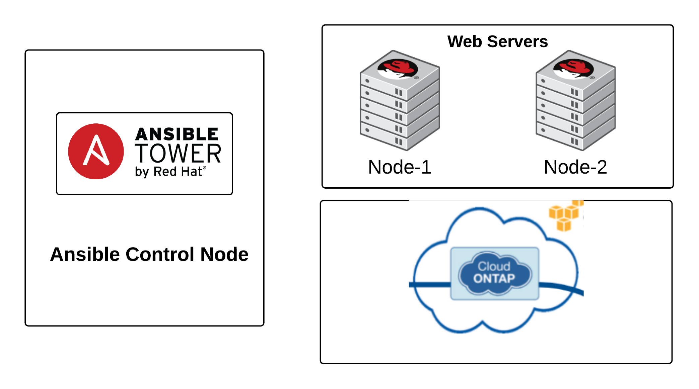

# Ansible Storage Automation Workshop

This content is a multi-purpose toolkit for effectively demonstrating Ansible's capabilities on storage equipment or providing informal workshop training in various forms -- instructor-led, hands-on or self-paced.

## Presentation
Want the Presentation Deck?  Its right here:
[Ansible storage Automation Workshop Deck](https://ansible.github.io/workshops/decks/ansible_storage.pdf)

## Ansible storage Automation Exercises

- [Exercise 1 - Exploring the lab environment](./1-explore/)
- [Exercise 2 - Execute your first storage automation playbook](./2-first-playbook/)
- [Exercise 3 - Use Ansible facts on storage devices](./3-facts/)
- [Exercise 4 - Use variables in your playbooks](./4-variables/)
- [Exercise 5 - Explore the Ansible Tower environment](./5-explore-tower/)
- [Exercise 6 - Create an Ansible Tower Job Template](./6-tower-job-template/)
- [Exercise 7 - Create an Ansible Tower Survey](./7-tower-survey/)
- [Exercise 8 - Create an Ansible Tower Workflow](./9-tower-workflow)

## storage Diagram

## Additional information
 - [Storage Automation with Ansible Homepage](https://www.ansible.com/storage-automation)
 - [List of Storage Ansible Modules](http://docs.ansible.com/ansible/latest/list_of_storage_modules.html)
 - [Module Maintenance & Support](http://docs.ansible.com/ansible/latest/modules_support.html)

---

